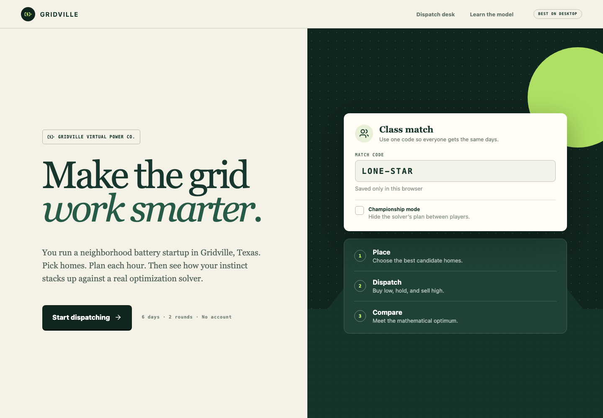

# Gridville

Gridville is an original, browser-based educational optimization game about placing and dispatching home batteries in a fictional Texas neighborhood. Players build a virtual power plant by hand, then compare their profit with a mixed-integer optimization model solved locally by [HiGHS](https://highs.dev/) through the MIT-licensed `highs-js` WebAssembly package.



## How to play

1. Pick candidate homes on the neighborhood map. Each installation has different capacity, power, efficiency, and cost.
2. Paint a 24-hour schedule for every battery, or start with **Buy low / sell high** and adjust it.
3. Lock the day. HiGHS finds the mathematical benchmark and reveals its chosen sites and dispatch.
4. In Round 2, both plans are made from a forecast and settled against the same surprise actual prices.

Every battery starts and ends the day empty. Profit includes electricity sales and purchases, fixed installation costs, and wear per kWh of battery throughput. A match code deterministically fixes all six days for classroom competition; no account or server is involved.

## Run locally

Requires a current Node.js LTS release.

```bash
npm ci
npm run dev
```

Open the local URL printed by Vite. Production and logic checks:

```bash
npm test
npm run build
```

The production build is emitted to `dist/`. GitHub Actions publishes `main` to GitHub Pages at <https://kvkenyon.github.io/battery-dispatch-game/>.

## Originality and license

Gridville's story, names, interface copy, generated data, artwork, and source code were created specifically for this project. It uses no copied game or website assets. Its game mechanics draw on general optimization teaching ideas and the facility-location literature.

Copyright (c) 2026 Kevin Kenyon. Released under the [MIT License](LICENSE).
