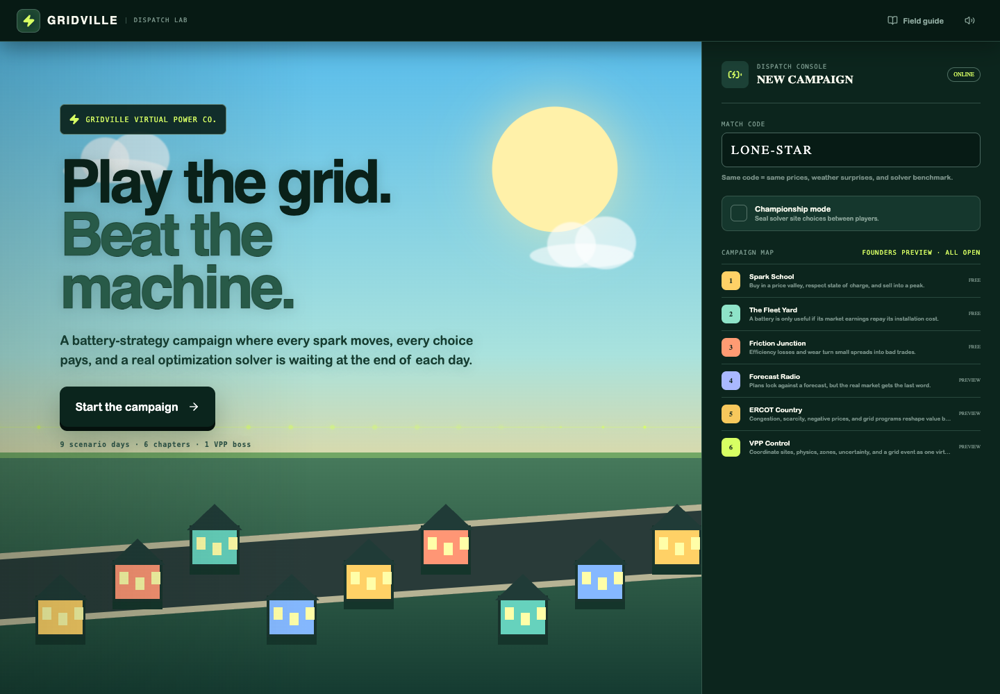

# Gridville

Gridville is an original, browser-based optimization strategy game about running home batteries in a fictional Texas neighborhood. Players build a virtual power plant by hand, paint its dispatch directly onto the market curve, play the day forward, then face a mixed-integer benchmark solved locally by [HiGHS](https://highs.dev/) through the MIT-licensed `highs-js` WebAssembly package.



## How to play

1. Pick glowing homes directly on the animated neighborhood map.
2. Drag charge, hold, and discharge regions across the 24-hour price curve.
3. Scrub or play the day to watch sunlight, state of charge, and electricity flows change together.
4. Lock the day. HiGHS sweeps its benchmark plan onto the town and awards an S–D grade.
5. Progress through nine scenario days covering spreads, fleet economics, physics losses, forecast risk, ERCOT-style zonal markets, demand response, and a full VPP boss.

Every battery starts and ends the day empty. Profit includes electricity sales and purchases, fixed installation costs, wear per kWh of battery throughput, and explicitly modeled event credits. A match code deterministically fixes all nine days for classroom competition; no account or server is involved.

Campaign content lives in the manifest in `src/data.ts`. Chapters 1–3 are tagged `free`; later chapters are tagged `premium` but remain unlocked by the founders-preview flag. There is no payment code. See [the content-tier seam](docs/monetization.md).

## Run locally

Requires a current Node.js LTS release.

```bash
npm ci
npm run dev
```

Open the local URL printed by Vite. Production and logic checks:

```bash
npm test
npm run build
```

The production build is emitted to `dist/`. GitHub Actions publishes `main` to GitHub Pages at <https://kvkenyon.github.io/battery-dispatch-game/>.

## Originality and license

Gridville's story, names, interface copy, generated data, artwork, and source code were created specifically for this project. It uses no copied game or website assets. Its game mechanics draw on general optimization teaching ideas and the facility-location literature.

Copyright (c) 2026 Kevin Kenyon. Released under the [MIT License](LICENSE).
